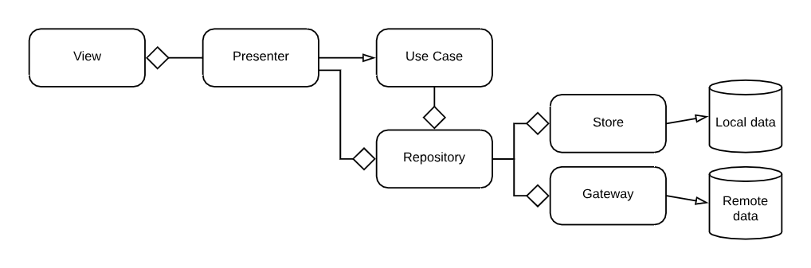

## Building 
To build a development version of the app from source, follow the instructions outlined below. 

1. Download and install [Android Studio](http://developer.android.com/sdk/index.html).
2. Clone the project or a fork of it to your local development machine.
3. Import the project into Android Studio.
4. Sync the project with Gradle files to download all the dependencies.
5. Open the SDK manager to install the required Android SDK Tools and Android SDK Build-tools.
7. Required: 
    1. Create a new file in the main directory called `gradle.properties`.
    2. Input the Fabric API Key. If you don't have one, use `fabricApiKey=000`.

8. Build the project.

## Developing guidelines (first draft)
The diagram below shows a rough overview of which components can be present and how they should interact.

A diamond indicates that a calling component should talk to an interface of this component. These
make it easy to swap implementations should it ever be needed, and helps with testing.

### View
The view defines the UI, delegates input events to the presenter and handles platform specific
details that are required for the presenter to function. The latter includes, but is not limited to,
handling the requesting of runtime permissions.

### Presenter
The presenter is responsible for acting on the events the view reports, deciding what should happen
on an event (possibly requesting additional components (use case, repository) to do some work) and
telling the view when it should change and what needs to be changed.

Note that it is the view's responsibility _how_ it does its job. E.g. the presenter can tell the view
to display a list of items, but the presenter does not care how the view does this.

The presenter communicates with the view through an interface that the view implements. This keeps
the presenter unaware of the platform it is running on, and helps with testing.

A view and a presenter have a one-on-one relationship.

### Repository
The repository is responsible for fetching data for its caller and carrying out actions in its
name. The idea is that the caller knows what it needs, but does not care about how it is fetched
or executed or where it comes from.

The repository is responsible for the data. It knows if data should be fetched and where from, 
but not how this is done. The repository decides whether to request local or remote data for example,
and it will also cache any data, if applicable.

The repository will transform external data into application data and vice versa. I.e. it will
provide a store or a gateway with the exact data it needs to for an operation and it will parse
their response to a format the application understands (User object for example).

### Use Case
A use case is similar to a repository in the sense that it acts on behalf of its caller, only typically
use cases consist of a set of code that logically belongs together.

I.e. a repository typically offers functionality like `getX()` or `storeY()` that are contextually
similar but logically separate. For example `UserRepository#getUser()` and 
`UserRepository#storeUser(user)`. They both operate on user data, but they do not depend on each
other nor must they be used in together. Building on that example, consider a `RegisterUserUseCase`.
This use case might be doing multiple things sequentially, such as 

1. Creating a user object.
2. Passing it to the repository to have it stored in the cloud.
3. Passing it to the repository to have it stored locally.
4. Anything else that belongs to the registration process.

### Store
The store is responsible for interacting with local data sources. Think about SQLite database and
such.

### Gateway
The gateway is responsible for interacting with remote data sources. Think about rest APIs and such.
It is important to note that remote sources are not necessarily physically remote sources. A 3rd party
app that accepts or provides data is also a remote source from the perspective of our application.
